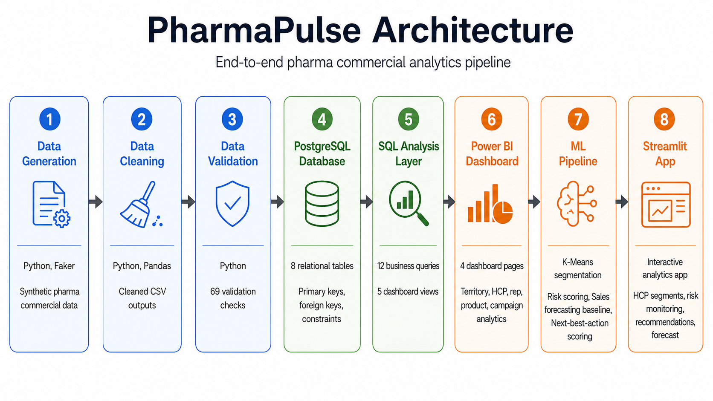
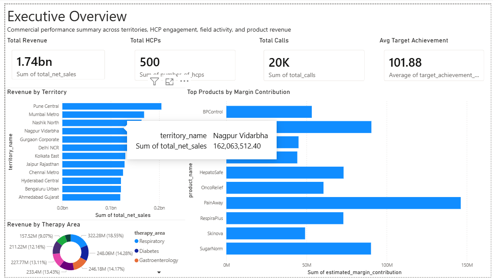
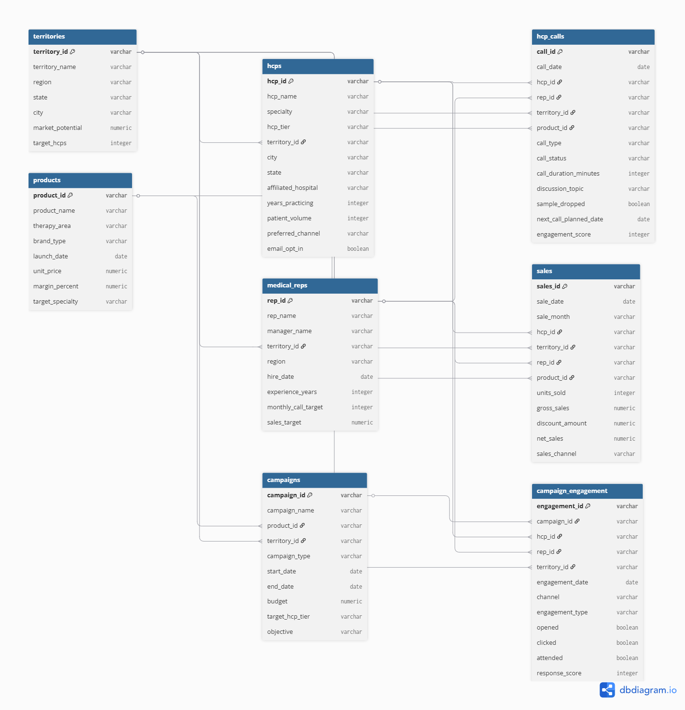
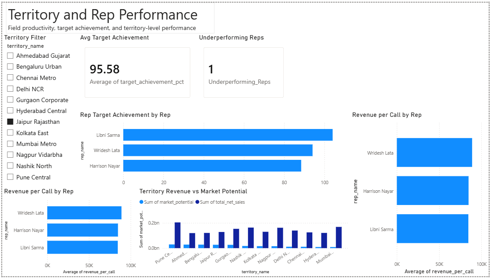
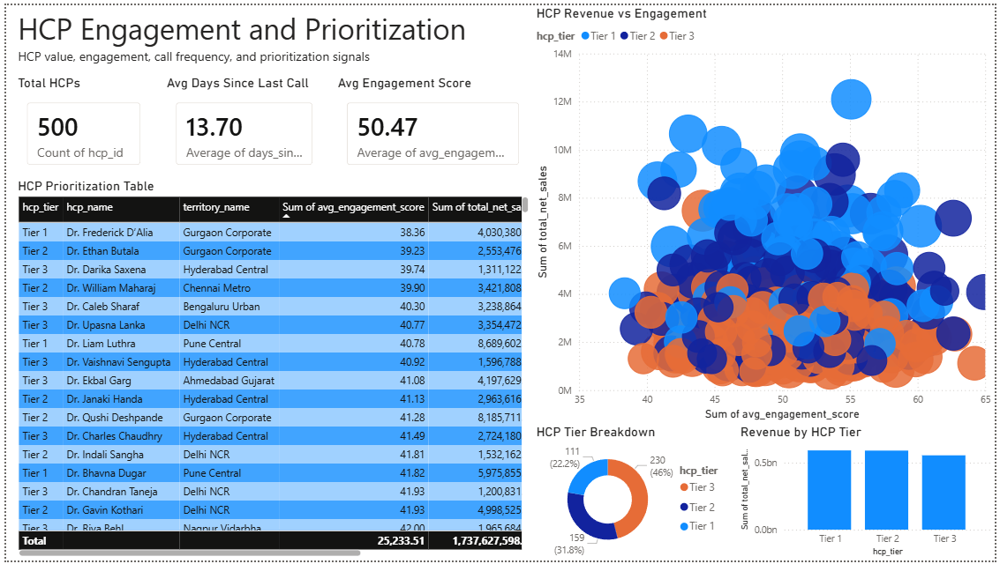
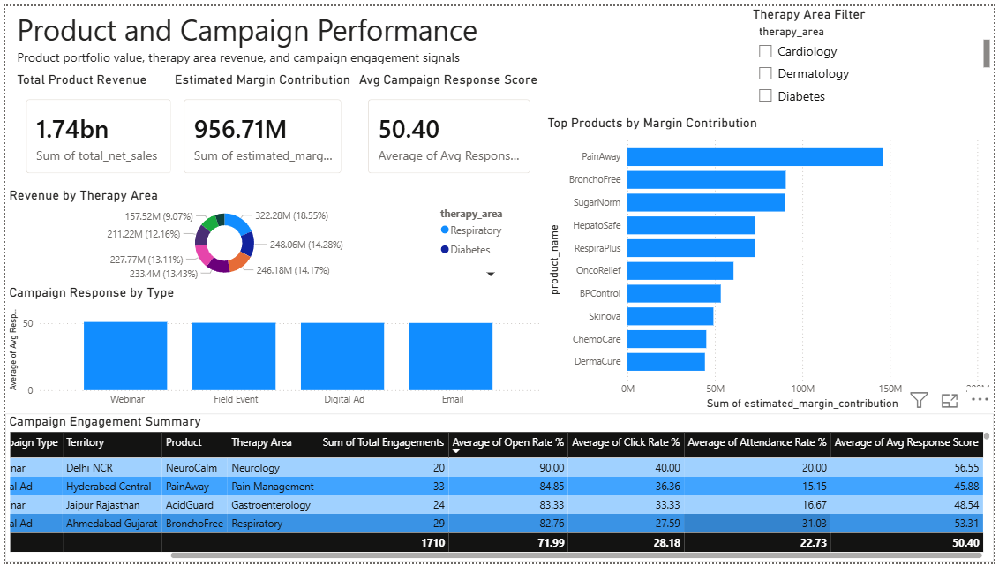

# PharmaPulse

End-to-end pharma commercial analytics platform for HCP engagement, medical rep performance, territory revenue, campaign effectiveness, product margin contribution, ML-based HCP scoring, and Streamlit decision support.

[](https://pharmapulse-analytics.streamlit.app/)






## Business Problem

Commercial pharma teams often need to evaluate HCP engagement, medical rep target achievement, campaign response, territory performance, and product margin contribution across separate reporting workflows. PharmaPulse brings these signals together into one analytics platform so call planning, field coaching, territory review, and portfolio decisions can be supported with consistent, directional evidence.

The project focuses on practical commercial questions: which HCPs need follow-up, which reps are close to target, which territories show stronger revenue efficiency, and which products contribute more margin. These metrics are treated as planning signals and proxies, not causal proof of sales impact.

## Solution Overview

PharmaPulse simulates a full commercial analytics workflow: synthetic data generation, cleaning, validation, PostgreSQL modeling, SQL analytics, Power BI reporting, ML-based HCP scoring, and a Streamlit decision-support app. The platform is designed to be easy to run locally while still reflecting realistic pharma commercial concepts such as HCP tiering, engagement score, therapy area, sales target, and campaign response.

The pipeline creates 8 related commercial datasets, validates 69 data-quality rules, loads cleaned outputs into PostgreSQL, and produces SQL views, Power BI pages, ML scoring files, and a Streamlit app.

## Tech Stack

| Layer / Tool | Purpose |
|---|---|
| Python + Faker | Synthetic pharma commercial data generation |
| Pandas | Data cleaning, transformation, and feature engineering |
| PostgreSQL | Relational schema with 8 tables and FK constraints |
| SQLAlchemy | Python-to-database loading pipeline |
| SQL | Business analysis queries and dashboard-ready views |
| Scikit-learn | HCP segmentation and scoring models |
| Streamlit + Plotly | Interactive analytics and decision-support app |
| Power BI | Executive dashboard and commercial KPI reporting |
| Markdown | Project documentation and insights reporting |

## Data Foundation

The dataset covers 8 commercial entities, including 19,751 HCP calls, 17,967 sales records, and 1,710 campaign engagement records.

| Dataset | Rows |
|---|---:|
| territories | 12 |
| products | 25 |
| hcps | 500 |
| medical_reps | 40 |
| campaigns | 60 |
| hcp_calls | 19,751 |
| sales | 17,967 |
| campaign_engagement | 1,710 |

Validation summary:

| Checks | Passed | Failed |
|---:|---:|---:|
| 69 | 69 | 0 |

## Database Model



The PostgreSQL model uses 8 connected tables: `territories`, `products`, `hcps`, `medical_reps`, `campaigns`, `hcp_calls`, `sales`, and `campaign_engagement`. Foreign key constraints preserve the relationships between HCP activity, rep assignments, product sales, campaign response, and territory structure, creating a reliable base for SQL analysis and dashboard-ready views.

The schema separates core entities from transactional activity so metrics can be aggregated safely without inflating results. Dashboard views pre-aggregate sales, call, and engagement data before joining them, which keeps reporting logic consistent across territory, rep, HCP, campaign, and product views.

## Analytics Layer

The SQL layer includes 12 business-focused queries covering total revenue, territory performance, therapy area performance, HCP revenue, medical rep target achievement, revenue per call, campaign response, product margin contribution, monthly growth, and next-best HCP candidates. The dashboard layer includes 5 PostgreSQL views built to avoid row multiplication across sales, call, and engagement activity.

The reporting layer includes a 4-page Power BI dashboard and a Streamlit app powered by processed ML outputs. The ML pipeline creates HCP segmentation, rule-based disengagement risk scoring, a sales forecast baseline with a directional range, next-best-action scoring, and a unified HCP master score table.

The ML layer is deliberately explainable. HCP segments are built from revenue, calls, engagement, and recency; risk scoring uses transparent rules; the forecast is positioned as a baseline; and next-best-action scoring combines percentile ranks and segment weights into a prioritization score.

## Dashboard Screenshots

**Executive Overview**


**Territory & Rep Performance**



**HCP Engagement**



**Product & Campaign Performance**



## Key Insights

- Territory efficiency varies meaningfully despite similar HCP coverage, with Gurgaon Corporate showing stronger revenue per call than Pune Central despite lower total sales.
- Rep performance forms clear coaching segments, with target achievement ranging from 70.5% to 147.9%.
- Product portfolio value is margin-sensitive, with PainAway producing stronger estimated margin contribution than some higher-volume products.
- HCP prioritization requires more than tier alone because high-value HCPs can still show call recency risk.
- Campaign coverage appears healthy, while open rate, click rate, and attendance rate provide clearer behavioral signals than response score alone.

For the full business brief, see [docs/insights_report.md](docs/insights_report.md).

These insights are intended to guide review conversations rather than prescribe decisions automatically. In a real deployment, the same framework would be strengthened with prescribing behavior, access constraints, formulary status, competitive activity, and field-force capacity.

## How to Run Locally

The project can be run locally from generated CSVs through PostgreSQL loading, ML output generation, and the Streamlit app. PostgreSQL is required for the database-loading step, while the Streamlit app reads processed CSV outputs and does not need a live database connection.

Clone the repository:

```bash
git clone https://github.com/3bodysolution/PharmaPulse.git
cd PharmaPulse
```

Create and activate a virtual environment:

```bash
python -m venv venv
venv\Scripts\activate
```

Install dependencies:

```bash
pip install -r requirements.txt
```

Create a local environment file and update it with your PostgreSQL credentials:

```bash
copy .env.example .env
```

Run the data, database, and ML pipeline:

```bash
python scripts/generate_data.py
python scripts/clean_data.py
python scripts/validate.py
python scripts/load_to_database.py
python scripts/ml_pipeline.py
```

Launch the Streamlit app:

```bash
streamlit run streamlit_app/app.py
```

Open the Power BI dashboard in Power BI Desktop:

```text
dashboard/pharmapulse_dashboard.pbix
```

## Folder Structure

```text
PharmaPulse/
|-- dashboard/
|   |-- pharmapulse_dashboard.pbix
|   `-- screenshots/
|-- data/
|   |-- raw/
|   |-- cleaned/
|   |-- processed/
|   `-- sample_outputs/
|-- docs/
|   |-- architecture.png
|   |-- er_diagram.png
|   |-- data_dictionary.md
|   `-- insights_report.md
|-- notebooks/
|   |-- 03_exploratory_analysis.ipynb
|   `-- 04_ml_models.ipynb
|-- scripts/
|   |-- generate_data.py
|   |-- clean_data.py
|   |-- validate.py
|   |-- load_to_database.py
|   `-- ml_pipeline.py
|-- sql/
|   |-- 01_create_tables.sql
|   |-- 02_load_data.sql
|   |-- 03_analysis_queries.sql
|   `-- 04_views_for_dashboard.sql
|-- streamlit_app/
|   `-- app.py
|-- .env.example
|-- requirements.txt
`-- README.md
```

## Future Enhancements

- Add a dbt transformation layer for modular SQL modeling.
- Create an automated data refresh workflow.
- Integrate CRM or commercial activity data for richer field context.
- Extend forecasting by territory and therapy area.
- Add territory optimization logic for call planning and coverage review.
